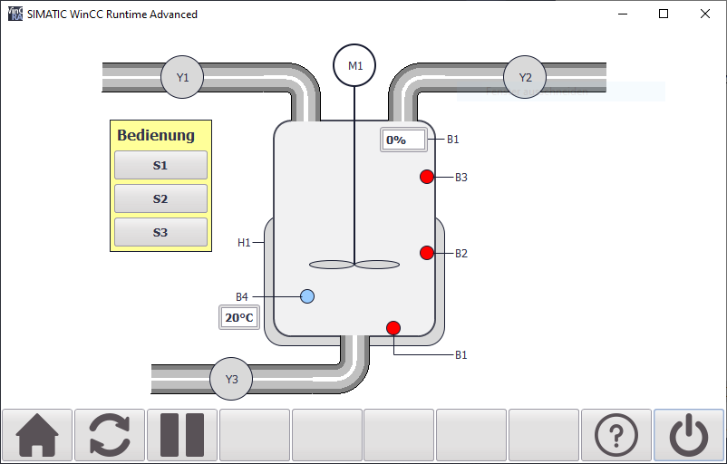

# Reaktionsprozess

## Belegungstabellen

Das an den Eingang __#PAA_AB0__ zu übergebende Ausgangsbyte ist wie folgt belegt:

Bit | Betriebsmittel | Beschreibung
--- | -------------- | ------------
  0 |             Y1 | Zulaufventil 1
  1 |             Y2 | Zulaufventil 2
  2 |             Y3 | Ablassventil
  3 |             H1 | Heizung
  4 |             M1 | Rührmotor

Das an am Ausgang __#PAE_EB0__ ausgegebene Eingangsbyte liefert folgende Signale:

Bit | Betriebsmittel | Beschreibung
--- | -------------- | ------------
  0 |             S1 | Taster S1 (NO)
  1 |             B1 | Niveauschalter unten (NO)
  2 |             B2 | Niveauschalter mitte (NO)
  3 |             B3 | Niveauschalter oben (NO)
  4 |             B4 | Temperatursensor (NO)
  5 |             S2 | Taster S2 (NO)
  6 |             S3 | Taster S3 (NC)

Der Ausgang __#PAE_EW64__ liefert den aktuellen Füllstand als Analogwert, wobei 0V bis 10V einen Füllstand von 0% bis 100% entsprechen.

## Beispielaufgabe

In einem Behälter werden zwei unterschiedliche chemische Ausgangsstoffe zusammengeführt, bis zu einer vorgegebenen Temperatur erwärmt und danach noch eine bestimmte Zeit gerührt.

Nach Betätigung des Tasters _S1_ wird, sofern der Behälter leer und das Ventil _Y3_ geschlossen ist, das Vorlaufventil _Y1_ geöffnet, bis der Niveauschalter _B2_ anspricht.

Danach schaltet das Rührwerk _M1_ ein und das Ventil _Y2_ wird geöffnet.

Spricht der Niveuaschalter _B3_ an, schliesst das Ventil _Y2_ wieder und die Heizung _H1_ schaltet ein.

Meldet der Temperatursensor _B4_ das Erreichen der vorgegebenen Temperatur, wird die Heizung _H1_ abgeschaltet und für 10 Sekungen weiter gemischt. Danach schaltet das Rührwerk ab und das Ventil _Y3_ öffnet.

Meldet der Niveauschalter _B1_, dass der Behälter leer ist, wird das Ventil _Y3_ wieder geschlossen und der Prozessablauf kann wiederholt werden.

Mit dem Taster _S2_ kann die Ablaufkette in zurückgesetzt bzw. initialisiert werden.

Mit dem Taster _S3_ kann der Prozess vorzeitig beendet werden. Dabei werden alle Aktoren abgeschaltet und das Ventil _Y3_ geöffnet, bis der Behälter wieder leer ist. Danach kann der Prozessablauf erneut gestartet werden.
