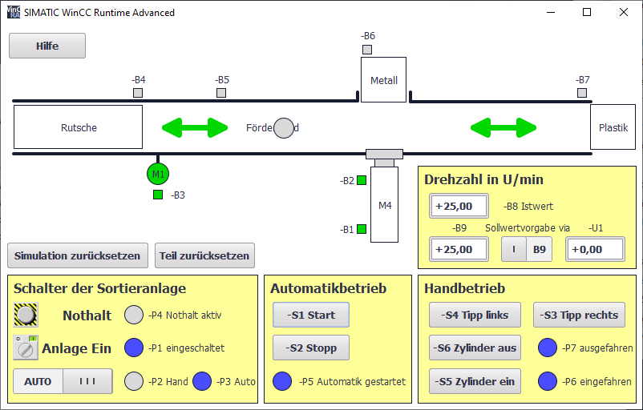

# Sortieranlage

## Belegungstabellen

Das am Eingang __#PAA_AW0__ übergebende Ausgangswort ist wie folgt belegt:

Bit | Betriebsmittel | Beschreibung
--- | -------------- | ------------
0.0 |             Q1 | Bandmotor -M1 vorwärts feste Drehzahl
0.1 |             Q2 | Bandmotor -M1 rückwärts feste Drehzahl
0.2 |             Q3 | Bandmotor -M1 variable Drehzahl
0.3 |             M2 | Zylinder -M4 einfahren
0.4 |             M3 | Zylinder -M4 ausfahren
0.5 |             P1 | Anzeige "Anlage ein"
0.6 |             P2 | Anzeige Betriebsart "HAND"
0.7 |             P3 | Anzeige Betriebsart "AUTO"
1.0 |             P4 | Anzeige "NOTHALT aktiviert"
1.1 |             P5 | Anzeige "Automatik gestartet"
1.2 |             P6 | Anzeige Zylinder "-M4 eingefahren"
1.3 |             P7 | Anzeige Zylinder "-M4 ausgefahren"

Das am Eingang __PAA_U1__ übergeben Ausgangswort erwartet einen Analogwert zwischen -10V und +10V, was einer Solldrehzahl von -50U/min bis +50U/min entspricht.

Das am Ausgang __#PAE_EW0__ ausgegebene Eingangswort liefert folgende Signale:

Bit | Betriebsmittel | Beschreibung
--- | -------------- | ------------
0.0 |             A1 | Meldung NOTHALT ok (nc)
0.1 |             K0 | Anlage "Ein" (no)
0.2 |             S0 | Schalter Betriebswahl Hand (0) / Automatik (1)
0.3 |             S1 | Taster Automatik Start (no)
0.4 |             S2 | Taster Automatik Stopp (nc)
0.5 |             B1 | Sensor Zylinder -M4 eingefahren (no)
0.6 |             B2 | Sensor Zylinder -M4 ausgefahren (nc)
0.7 |             B3 | Sensor Bandmotor -M1 läuft (gepulstes Signal auch für Positionierung geeignet) (no)
1.0 |             B4 | Sensor Rutsche belegt (no)
1.1 |             B5 | Sensor Teilerkennung Metall (no)
1.2 |             B6 | Sensor Teil vor Zylinder -M4 (no)
1.3 |             B7 | Sensor Teil am Ende des Bandes (no)
1.4 |             S3 | Taster Tippbetrieb Band –M1 vorwärts (no)
1.5 |             S4 | Taster Tippbetrieb Band –M1 rückwärts (no)
1.6 |             S5 | Taster Tippbetrieb Zylinder -M4 einfahren (no)
1.7 |             S6 | Taster Tippbetrieb Zylinder -M4 ausfahren (no)

Der Ausgang __#PAE_B8__ liefert die aktuelle Drehzahl des Motors als Analogwert, wobei -10V bis +10V einer Drehzahl von -50U/min und +50U/min entsprechen.

Der Ausgang __#PAE_B9__ liefert eine Sollwertvorgabe über ein Potentiometer von -10V bis +10V.

## Beispielaufgabe

Beispielaufgaben zu dieser Anlage finden sich auf der [Siemens SCE](http://www.siemens.de/sce) Webseite.
