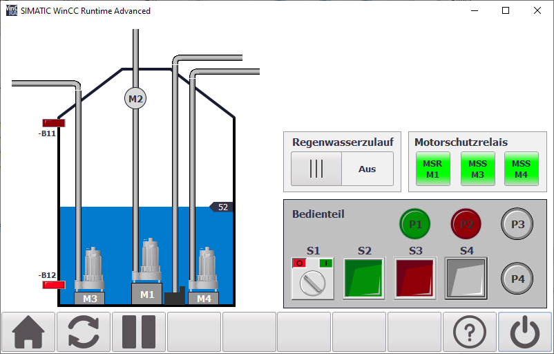

# Anlage der EBT Abschlussprüfung Teil 2

## Belegungstabellen

Das am Eingang __#PAA_AB0__ übergebende Ausgangsbyte ist wie folgt belegt:

Bit | Betriebsmittel | Beschreibung
--- | -------------- | ------------
0.0 |             M1 | Pumpe "Nutzwasserpumpe"
0.1 |             M2 | Ventil "Nutzwasserpumpe"
0.2 |             M3 | Pumpe "Abwasser 1"
0.3 |             M4 | Pumpe "Abwasser 2"
0.4 |             P1 | Meldeleuchte "Anlage EIN"
0.5 |             P2 | Meldeleuchte "Störung"
0.6 |             P3 | Meldeleuchte "Wasserstand < 25%"
0.7 |             P4 | Meldeleuchte "Wasserstand > 75%"

Das am Ausgang __#PAE_EW0__ ausgegebene Eingangswort liefert folgende Signale:

Bit | Betriebsmittel | Beschreibung
--- | -------------- | ------------
0.0 |             S1 | Schalter "Anlage EIN/AUS" (NO)
0.1 |             S2 | Taster "Nutzwasser EIN" (NO)
0.2 |             S3 | Taster "Nutzwasser AUS" (NC)
0.3 |             S4 | Taster "Tank leeren" (NO)
0.4 |                | _nicht belegt_
0.5 |             B1 | Hilfskontakt Motorschutzrelais -M1 (NO)
0.6 |             B2 | Hilfskontakt Motorschutzschalter -M3 (NO)
0.7 |             B3 | Hilfskontakt Motorschutzschalter -M4 (NO)
1.0 |            B11 | Sensor Rutsche belegt (no)
1.1 |            B12 | Sensor Teilerkennung Metall (no)

Der Ausgang __#PAE_EW64__ liefert die Werte für den Füllstandssensor _B13_ (0-10V).

## Beispielaufgabe

Diese Anlage bezieht sich auf die Abschlussprüfung Teil 2 für den Elektroniker/-in für Betriebstechnik. Den Arbeitsauftrag gibt es bei der [PAL](https://www.stuttgart.ihk24.de/pal/elektrotechnische-berufe/materialbereitstellung-ausbildungsbetrieb/sommer2019) zum download.
